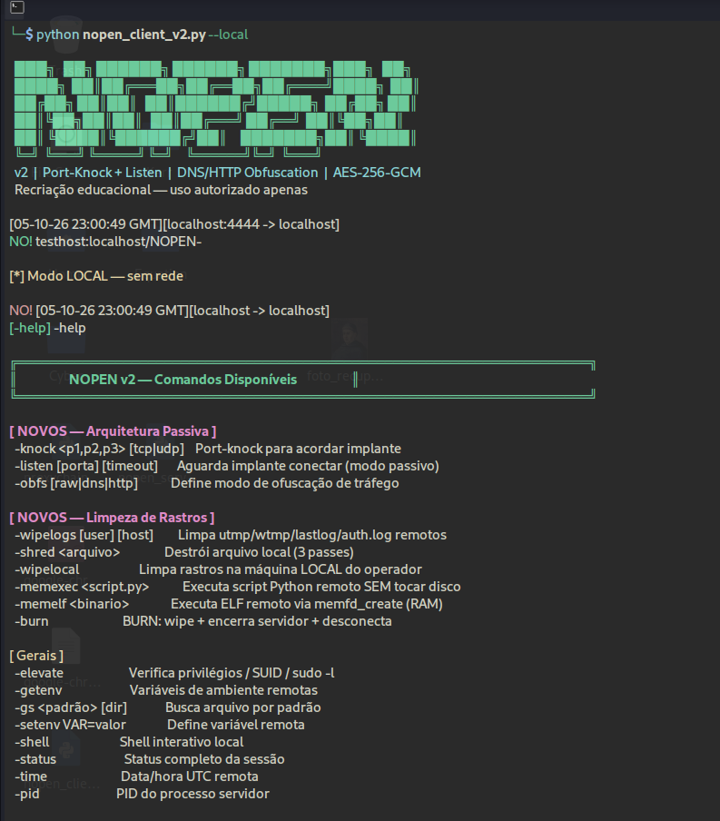

## NOPEN (Advanced Remote Administration)

<p align="center">
  
</p>

```console
$ ./nopen_client_v2.py --help

NOPEN Client — Remote Administration Tool

--[ Passive Architecture (Port-knocking + Listen mode)
--[ Traffic Obfuscation (AES-256-GCM frames disguised as DNS/HTTP)
--[ Persistence & Cleanup (utmp/wtmp/lastlog wipe, in-memory exec)

commands & usage:

  [active connect] Connect to NOPEN server
        ├─ targets remote listener IP and port (default: 4444)
        └─ executes RSA-2048 / AES-256-GCM mutual authentication

  [listen & knock] Wake-up passive implant
        ├─ -knock <p1,p2,p3> [tcp|udp]: Sends port-knock sequence
        ├─ -listen [port]: Waits for implant to connect back (bypasses NAT)
        └─ useful for stealthy, on-demand command and control

  [session commands] 
        → -wipelogs
            [1] Parses and cleans utmp/wtmp/lastlog structures on target
            [2] Greps and removes specific traces from auth.log and syslog
            [3] Rebuilds logs to ensure no file corruption is detected

        → -memexec / -memelf
            [1] Transmits Python script or ELF binary over encrypted channel
            [2] Creates anonymous file descriptor via memfd_create
            [3] Executes payload entirely in Volatile RAM (Zero disk footprint)

        → -burn
            [1] Transmits panic DESTRUCT_ORDER to server
            [2] Scraps internal temp files, sockets, and logs
            [3] Terminates remote process and drops connection

notes:
  - NOPEN Strict mode: only RSA-2048 / SHA-256 / AES-256-GCM are negotiated.
  - Trace wiping and memory execution require appropriate OS privileges (Root on Linux).
```
